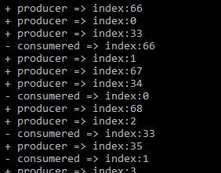

Simple .Net Core Queue(producer-consumer) Manager
=========================
Simple.NETCore.QueueManager is a basic producer-consumer model that uses dataflow. for .Net Core

.net core producer-consumer sample:
<br />
The Produce method calls the Post method in a loop to synchronously write data to the target block. After the Produce method writes all data to the target block, it calls the Complete method to indicate that the block will never have additional data available. The Consume method uses the async and await operators to asynchronously compute the T data type that are received from the BlockingCollection<T> object.

Sample
------

```c#
static void Main(string[] args)
{
    Func<int, string> producer = (index) =>
    {
        System.Threading.Thread.Sleep(1500);
        var todoSome = $"index:{index}";
        Console.WriteLine($" + producer => {todoSome}");
        return todoSome;
    };

    Action<string> consumer = (result) =>
    {
        System.Threading.Thread.Sleep(1000);
        Console.WriteLine($" - consumered => {result}");
    };

    var queueConfigurations = new QueueConfigurations(3, 1);
    var queueService = new QueueService<string>(queueConfigurations);
    queueService.StartProcess(100, producer, consumer);

    foreach (var ex in queueService.Exceptions)
        Console.WriteLine($"Exception-> Method:{ex.Method}|Message:{ex.Message}");

}
```
output:
<br />


<br />

Resource
---------
[How to: Implement a Producer-Consumer Dataflow Pattern](https://docs.microsoft.com/en-us/dotnet/standard/parallel-programming/how-to-implement-a-producer-consumer-dataflow-pattern) <br />

[BlockingCollection&lt;T&gt;](https://docs.microsoft.com/tr-tr/dotnet/api/system.collections.concurrent.blockingcollection-1)
